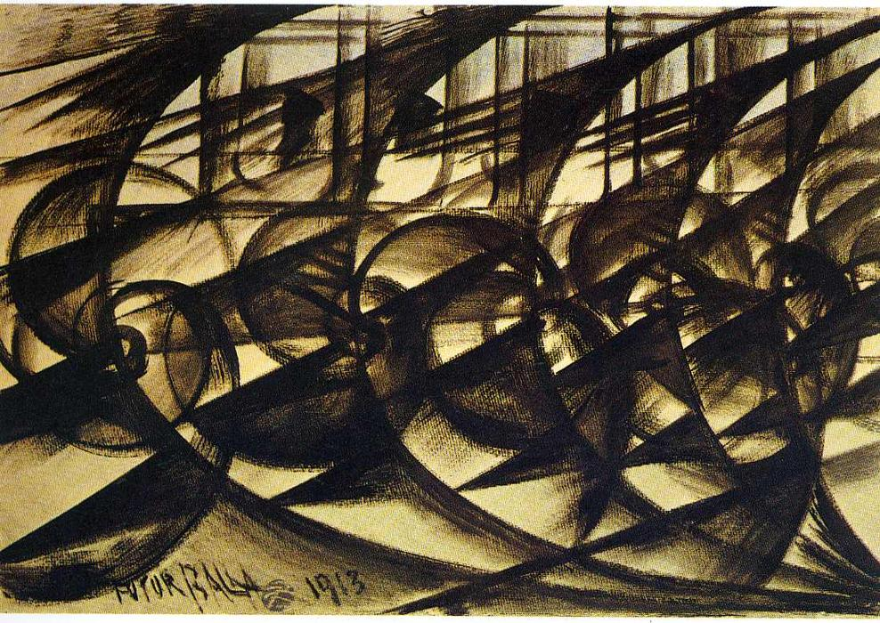
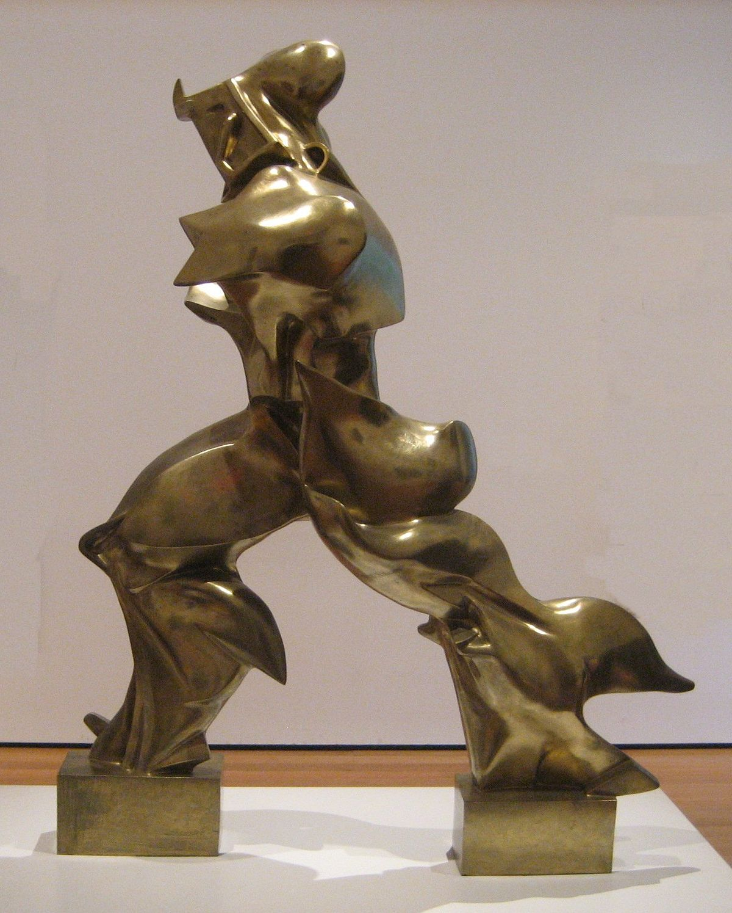

# Futurismo

## Descrição

* Nasce com destaque na literatura, com o **Manifesto Futurista**, de Marinetti em **1909** \
  \-> Objetivo: destruir as tradições artísticas passadas para criar uma arte que se conectasse com tecnologia, mecanização, força e energia
* Desvalorização da tradição -> Valorização do Moderno
* Paleta de cores vivas
* Soberania do homem e desprezo pela mulher
* Desenvolvimento industrial e novas tecnologias -> Culto às máquinas&#x20;
* Técnicas que reproduzem o movimento, em alusão à velocidade
* Movimento apoiado no fascismo italiano

## Giacomo Balla (1871 - 1958)

* Tela 1: O dinamismo de um cão na coleira -> Ideia de movimento do passeio do cachorro

<figure><figcaption>
O dinamismo de um cão na coleira, de Giacomo Balla (1912)
</figcaption></figure>

 

<figure><figcaption>
Velocidade de um automóvel, de Giacomo Balla (1913)
</figcaption></figure>

## Umberto Boccioni (1882 - 1916)

* Obra: Formas de continuidade no espaço -> A escultura ultrapassa os limites corpóreos do ser-humano, sendo que se assemelha a uma bandeira a esvoaçar com o vento. Parece que o corpo está lutando contra uma força invisível.

<figure><figcaption>
Formas únicas de continuidade no espaço, de Umberto Boccioni
</figcaption></figure>
