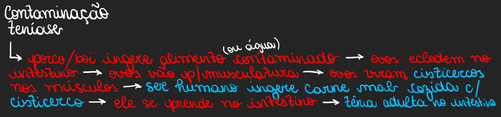

# Verminoses

## Ascaridíase

* _**Agente**_: _Ascaris lumbricoides_, a Lombriga&#x20;
* _**Contágio**_: Alimentos contaminados com ovos do verme.&#x20;
* _**Afeta**_: Área do Intestino&#x20;
* _**Sintomas**_: Náusea, Diarréia, Anemia&#x20;
* _**Tratamento**_: Remédio de Verme&#x20;
* _**Profilaxia**_: Cozinhar/Lavar alimentos antes de comer

<figure><figcaption></figcaption></figure>

***

## Oxiurose

* _**Agente**_: _Enterobius vermicularis_, o Oxiúro&#x20;
* _**Contágio**_: falta de higiene, levar os ovos à boca&#x20;
* _**Afeta**_: Intestino&#x20;
* _**Sintomas**_: Coceira no ânus, Dor abdominal, Enjoo&#x20;
* _**Tratamento**_: Remédio de verme&#x20;
* _**Profilaxia**_: Ter uma higiene melhor, lavar alimentos.

<figure><figcaption></figcaption></figure>

***

## Esquistossomose

* _**Agente**_: _Schistossoma mansoni_&#x20;
* _**Contágio**_: verme se aloja em caramujo, que o libera em rio e a pessoa se contamina com a água&#x20;
* _**Afeta**_: vasos sanguíneos, depois migra pra **fígado, intestino ou bexiga**&#x20;
* _**Sintomas**_: Dores generalizadas, Sangramentos, Náusea, Dirarréia, Tosse, Dermatite&#x20;
* _**Tratamento**_: Remédio pra Schistossoma&#x20;
* _**Profilaxia**_: Evitar água com caramujos e garantia de saneamento básico

<figure><figcaption></figcaption></figure>

***

## Teníase

* _**Agente**_: _Taenia solium (carne de porco)_ **ou** _Taenia saginata (carne de boi),_ a Tênia
* _**Contágio**_: consumo de carne suína ou bovina contaminada com ovos do verme
* _**Afeta**_: Intestino delgado
* _**Sintomas**_: Dores abdominais, diarreia, perda de peso, tontura, irritabilidade, cansaço, náusea
* _**Tratamento**_: Antiparasitário
* _**Profilaxia**_: Evitar a ingestão de carnes mal cozidas

<figure><figcaption></figcaption></figure>
