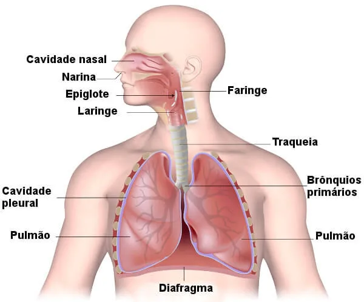

# Reino Animalia

## Características Gerais

Animais são organismos eucariontes, heterotróficos e pluricelulares que se movimentam durante seu ciclo de vida. O corpo destes é feito de tecidos.

* Distribuição (Seres Vivos)\
  → 65% Animais Invertebrados\
  → 5% Animais Vertebrados

### Multicelularidade

* Permitiu o surgimento de todos os animais
* Inicialmente, as células eram mais simples e pouco especializadas, o que foi evoluindo gradativamente até as mais complexas.

### Desenvolvimento Embrionário

<figure><figcaption>
Processo de Desenvolvimento Embrionário
</figcaption></figure>

* **Segmentação**: divisões acontecem no zigoto (clivagens), formando a **mórula** (célula toda dividida).
* O número de células aumenta, formando a cavidade **blastocele** e o embrião se torna a **blástula**.
* **Gastrulação**: células da blástula (embrião) comprimem o espaço da blastocele, fazendo seu espaço diminuir (“processo de invaginação”), a diferenciação começa, formando os folhetos embrionários, que vão criar os tecidos. → A blastocele some e o [**arquêntero** ](#user-content-fn-1)[^1]toma seu lugar.

## Animais Invertebrados

### Poríferos

* **Esponjas**

> Funçāo: alimento para tartarugas, abrigo pra peixes e medicamentos contra AIDS

* Aquáticos\
  → 98% Marinhos\
  → 2% Água Doce
* São acoplados/fixos a alguma superfície (sésseis) → Ex.: Fixos no fundo do mar
* Corpo coberto de **poros**
* Não possuem simetria, tecidos verdadeiros e órgãos
* São seres filtradores e podem viver sozinhos ou em colônias
* Não se locomovem e possuem alta capacidade de regeneração
* **Coanócitos** → Realizam a filtração e digestão (intracelular)
* Cavidade interna: **átrio**; água é eliminada pelo **ósculo** (“saída”)
* (FAZER FOTO) poro: entra água → átrio: água passa → ósculo: sai água

<figure><figcaption></figcaption></figure>

## Animais Vertebrados

[^1]: "intestino primitivo"
