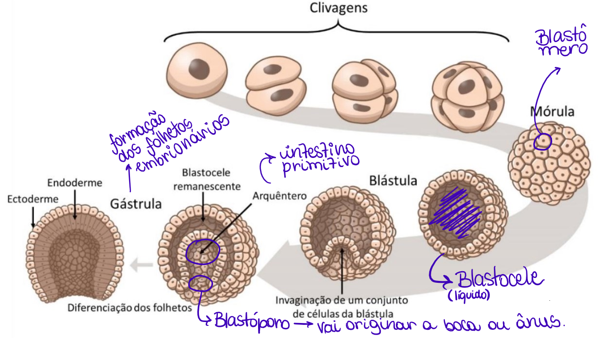

# Reino Animalia

## Características Gerais

Animais são organismos eucariontes, heterotróficos e pluricelulares que se movimentam durante seu ciclo de vida. O corpo destes é feito de tecidos.

* Distribuição (Seres Vivos)\
  → 65% Animais Invertebrados\
  → 5% Animais Vertebrados
* Todos os animais são **triblásticos** (3 folhetos embrionários), **exceto** os [Poríferos ](invertebrados/poriferos.md)(que não têm nenhum tecido) e os [Cnidários](invertebrados/cnidarios.md), que são **diblásticos** (2 folhetos embrionários)

<figure><figcaption></figcaption></figure>

### Multicelularidade

* Permitiu o surgimento de todos os animais
* Inicialmente, as células eram mais simples e pouco especializadas, o que foi evoluindo gradativamente até as mais complexas.

### Desenvolvimento Embrionário

* **Segmentação**: divisões acontecem no zigoto (clivagens), formando a **mórula** (célula toda dividida).
* O número de células aumenta, formando a cavidade **blastocele** e o embrião se torna a **blástula**.
* **Gastrulação**: células da blástula (embrião) comprimem o espaço da blastocele, fazendo seu espaço diminuir (“processo de invaginação”), a diferenciação começa, formando os folhetos embrionários, que vão criar os tecidos. → A blastocele some e o [**arquêntero** ](#user-content-fn-1)[^1]toma seu lugar.

<figure><figcaption></figcaption></figure>

## Metameria

* Possuir o corpo segmentado


Nos animais em que o blastóporo origina primeiro o **ânus**: temos <mark style="color:red;">**deuterostômios**</mark>

Nos animais em que o blastóporo origina primeiro a **boca**: temos <mark style="color:red;">**protostômios**</mark>


***

## Animais Invertebrados

* [Poríferos](invertebrados/poriferos.md)
* [Cnidários](invertebrados/cnidarios.md)

## Animais Vertebrados

[^1]: "intestino primitivo"
