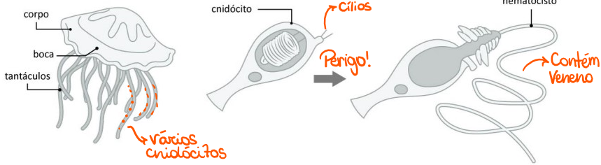

# Cnidários

## Características Gerais

* Pluricelulares, diblásticos (2 folhetos embrionários -> endo e ectoderme) e possuem simetria radial
* Locomoção \
  \-> Pólipos: Fixos \
  \-> Medusas: Nadam&#x20;

<figure><figcaption>
Água-viva (Medusa)
</figcaption></figure>

 

<figure><figcaption>
Anêmona-do-mar (Pólipo)
</figcaption></figure>

* Não possuem celoma e sistemas respiratório, circulatório e excretor
* O sistema digestório é incompleto, só tendo a boca
* Possuem simetria radial
* Digestão extra e intracelular
* Possuem sistema nervoso difuso (espalhado) -> Ajuda na contração
* Cnidoblastos ou **Cnidócitos** (grupo de células exclusivo) -> localizados nos tentáculos e  possuem cílios → protegem por meio da liberação de veneno (por meio do nematocisto) e ajuda a pegar alimentos

<figure><figcaption>
Cnidócios liberando o nematocisto
</figcaption></figure>

## Estrutura

<figure><figcaption>
Estruturas do Pólipo e da Medusa
</figcaption></figure>

### Pólipo

* tentáculo e boca para cima

### Medusa

* tentáculo e boca para baixo
* fase sexuada

## Reprodução

<figure><figcaption>
Alguns tipos de reprodução.
</figcaption></figure>

## Filos

* **Antozoários** -> Apenas fase de **pólipo** -> Anêmonas ou Corais&#x20;
* **Cifozoários** -> Fase de medusa é predominante, pouca fase de pólipo
* Hidrozoários -> Fase de pólipo é predominante, pouca fase de medusa
* **Cubozoários** -> Apenas fase de medusa
