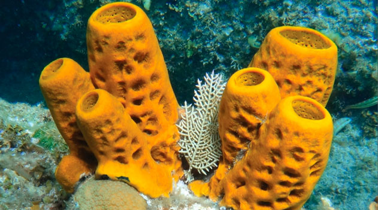

# Poríferos

## Características Gerais


Funçāo: alimento para tartarugas, abrigo pra peixes e medicamentos contra AIDS


<figure><figcaption>
Esponjas
</figcaption></figure>

* Aquáticos\
  → 98% Marinhos\
  → 2% Água Doce
* São acoplados/fixos a alguma superfície (sésseis) → Ex.: Fixos no fundo do mar
* Corpo coberto de **poros**
* **Não possuem simetria, tecidos verdadeiros e órgãos** \
  **->** Eles possuem mais de 20 tipos celulares especializados. Elas se juntam (justaposição) e exercem sua função, mas não chegam a formar um tecido
* São seres <mark style="color:red;">**filtradores**</mark> e podem viver sozinhos ou em colônias
* São hermafroditas
* Podem fazer reprodução sexuada ou assexuada (brotamento)
* Não se locomovem e possuem alta capacidade de regeneração
* Cavidade interna: **átrio**; água é eliminada pelo **ósculo** (“saída”)

<figure><figcaption></figcaption></figure>

## Células

* **Coanócitos** → Realizam a filtração e digestão (intracelular)
* **Porócitos** -> Água passa por eles -> Contém o ostíolo, que são os "poros"
* **Arqueócito** -> Forma os óvulos e os espermatozoides; Distribui os alimentos pelo corpo da esponja
* **Espícula** -> Dão suporte e fixação à esponja
* **Pinacócito** -> Células unidas que fazem o revestimento da esponja

<figure><figcaption>
Estrutura da Esponja e Funções das Células 
</figcaption></figure>
