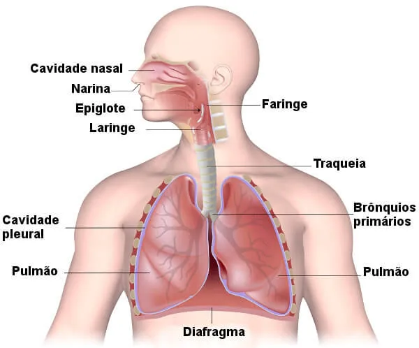

# Poríferos


Funçāo: alimento para tartarugas, abrigo pra peixes e medicamentos contra AIDS


<figure><figcaption>
Esponjas
</figcaption></figure>

* Aquáticos\
  → 98% Marinhos\
  → 2% Água Doce
* São acoplados/fixos a alguma superfície (sésseis) → Ex.: Fixos no fundo do mar
* Corpo coberto de **poros**
* Não possuem simetria, tecidos verdadeiros e órgãos
* São seres filtradores e podem viver sozinhos ou em colônias
* Não se locomovem e possuem alta capacidade de regeneração
* **Coanócitos** → Realizam a filtração e digestão (intracelular)
* Cavidade interna: **átrio**; água é eliminada pelo **ósculo** (“saída”)

<figure><figcaption></figcaption></figure>

