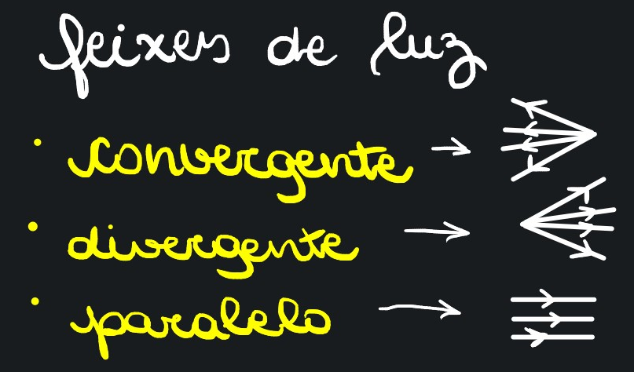

# Cap 10

## Conceitos Básicos

* Raio de luz -> Linhas que representam a direção e o sentido da propagação da luz \
  \-> Conjunto de raios de luz = Feixe de luz, que pode ser convergente, divergente ou paralelo.

<figure><figcaption></figcaption></figure>

### Fontes de Luz

* Simples/monocromática -> Cor única
* Composta/policromática -> Superposição de cores -> Ex.: Luz solar, que é branca&#x20;
* Corpo que emite luz -> Corpo Luminoso/Fonte Primária\
  \-> Ex.: Sol
* Corpo que reenvia luz recebida -> Corpo Iluminado/Fonte Secundária\
  \-> Ex.: Lua (que "pega" luz do Sol)


Luz branca pode ser percebida através de um prisma.


## Meios&#x20;

* Transparente: objetos <mark style="color:red;">**vistos nitidamente**</mark> por trás do meio \
  \-> Ex.: Vidro, ar
* Translúcido: objetos <mark style="color:red;">**vistos sem nitidez**</mark> por trás do meio \
  \-> Ex.: Vidro fosco, papel vegetal
* Opaco: objetos <mark style="color:red;">**não são vistos**</mark> por trás do meio \
  \-> Ex.: Madeira, concreto

<figure><figcaption></figcaption></figure>

## Fenômenos Ópticos


* Numa superfície de metal, sem muitas irregularidades, predomina a **reflexão**
* Numa superfície entre dois meios iguais e transparentes, predomina a **refração**


* **Reflexão Regular**: responsável pela formação de imagens \
  \-> Ex.: Imagens em superfícies de metal
* **Reflexão Difusa**: feita em superfícies irregulares, serve pra enxergar as imagens \
  \-> Ex.: Ver a parede
* **Refração Regular**: luz se propaga no ar e incide sobre a superfície de uma piscina, por exemplo
* **Refração Difusa**: emite a mesma luz anterior, só que em meio translúcido
* **Absorção**: superfície vai absorver a energia e se aquecer \
  \-> Corpo negro: absorção total \
  \-> Corpo cinza-escuro: absorção grande \
  \-> Corpo branco: há difusão

<figure><figcaption></figcaption></figure>

## Velocidade

* Velocidade de propagação da luz no vácuo -> 300.000km/s -> $$3 \times 10^5 km/s$$ \
  \-> Velocidade da luz varia de acordo com o tipo de luz monocromática, mas sempre será menor que a do vácuo. (A do vácuo é o melhor cenário imaginável)
* Ano-luz: distância percorrida pela luz no vácuo em 1 ano \
  \-> v = $$3 \times 10^5 km/s$$ -> $$\Delta t = 1$$ ano = $$3,6\times10^7 s$$ \
  \-> $$\Delta s = v \times \Delta t$$ -> $$3\times10^6 km/\cancel{s} \times 3,16\times 10^7\cancel{s}$$ \
  \-> **1 ano luz** ≈ $$9,5 \times 10^{12} km$$

## Cores por Reflexão

* A luz branca é formada por infinitas luzes monocromáticas \
  \-> 7 tons monocromáticos principais: vermelho, laranja, amarelo, verde, azul, anil e violeta
* Situação Exemplo: um corpo vermelho recebe luz branca. Esse corpo vai refletir apenas a luz vermelha (que compõe a branca) \
  \-> Isso vale para todos os corpos de "cores puras" (as 7) \
  \-> Corpo negro não reflete nada \
  \-> Corpo branco reflete tudo

### Cores&#x20;

* **Vermelho, verde e azul** -> Cores primárias
* **Amarelo** (vermelho + verde), **magenta** (vermelho + amarelo) e **ciano** (verde + azul)
* Cor secundária + primária (que não compôs a secundária) = branco \
  \-> Ex.: Amarelo (vermelho + verde) + Azul = branco

<figure><figcaption></figcaption></figure>

## Penumbra

* Em meios homogêneos e transparentes, a propagação de luz é em linha reta.
* Entre a luz em cima de um meio opaco "x", e outro meio opaco "y", existe uma sombra que não recebe a luz que "x" recebeu. \
  \-> Penumbra é o espaço com sombra parcial (recebe alguma luz)

<figure><figcaption></figcaption></figure>

## Eclipses

Podem ser totais ou parciais.

* Eclipse lunar: a lua é encoberta pela sombra da Terra (não dá pra vê-la)
* Eclipse solar: a lua faz sombra na Terra e "tapa" o Sol \
  \-> penumbral: a sombra vem junto com a penumbra gerada pela lua

## Câmara Escura de Orifícios

* É uma caixa de paredes opacas, com um buraco.
* Uma fonte de luz é colocada em frente ao buraco, e, dentro da caixa, é gerada uma imagem similar ao objeto luminoso, mas de **forma invertida**.

<figure><figcaption></figcaption></figure>

## Ângulo Visual

* É um ângulo gerado pela incidência dos feixes de luz A e B \
  \-> Quanto maior a distância, menor é o angulo visual, e menor parece o objeto.

<figure><figcaption></figcaption></figure>

### Limite de Acuidade Visual

* Até onde o observador consegue enxergar um objeto longínquo \
  \-> No ser humano: 1/60 graus.

## Reversibilidade dos Raios de Luz

* Em Reflexões e Refrações, a trajetória da luz não depende do sentido de propagação (representado pelo sentido das setas)

<figure><figcaption></figcaption></figure>

## Independência dos Raios de Luz

* Mesmo se cruzando, raios de luz seguem suas próprias trajetórias.

<figure><figcaption></figcaption></figure>

