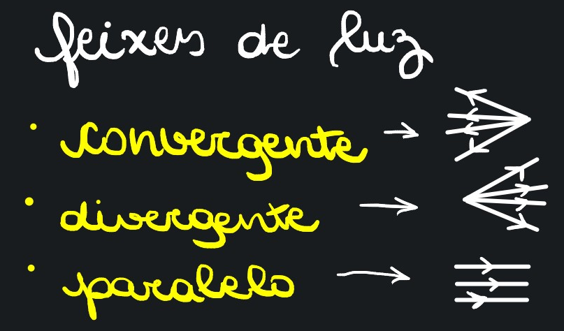

# Note 1

## Conceitos Básicos

* Raio de luz -> Linhas que representam a direção e o sentido da propagação da luz \
  \-> Conjunto de raios de luz = Feixe de luz, que pode ser convergente, divergente ou paralelo.

<figure><figcaption></figcaption></figure>

### Fontes de Luz

* Simples/monocromática -> Cor única
* Composta/policromática -> Superposição de cores -> Ex.: Luz solar, que é branca&#x20;
* Corpo que emite luz -> Corpo Luminoso/Fonte Primária\
  \-> Ex.: Sol
* Corpo que reenvia luz recebida -> Corpo Iluminado/Fonte Secundária\
  \-> Ex.: Lua (que "pega" luz do Sol)


Luz branca pode ser percebida através de um prisma.


## Meios&#x20;

* Transparente: objetos <mark style="color:red;">**vistos nitidamente**</mark> por trás do meio \
  \-> Ex.: Vidro, ar
* Translúcido: objetos <mark style="color:red;">**vistos sem nitidez**</mark> por trás do meio \
  \-> Ex.: Vidro fosco, papel vegetal
* Opaco: objetos <mark style="color:red;">**não são vistos**</mark> por trás do meio \
  \-> Ex.: Madeira, concreto

<figure><figcaption></figcaption></figure>

## Fenômenos Ópticos


* Numa superfície de metal, sem muitas irregularidades, predomina a **reflexão**
* Numa superfície entre dois meios iguais e transparentes, predomina a **refração**


* **Reflexão Regular**: responsável pela formação de imagens \
  \-> Ex.: Imagens em superfícies de metal
* **Reflexão Difusa**: feita em superfícies irregulares, serve pra enxergar as imagens \
  \-> Ex.: Ver a parede
* **Refração Regular**: luz se propaga no ar e incide sobre a superfície de uma piscina, por exemplo
* **Refração Difusa**: emite a mesma luz anterior, só que em meio translúcido
* **Absorção**: superfície vai absorver a energia e se aquecer \
  \-> Corpo negro: absorção total \
  \-> Corpo cinza-escuro: absorção grande \
  \-> Corpo branco: há difusão

<figure><figcaption></figcaption></figure>

## Velocidade

* Velocidade de propagação da luz no vácuo -> 300.000km/s -> $$3 \times 10^5 km/s$$ \
  \-> Velocidade da luz varia de acordo com o tipo de luz monocromática, mas sempre será menor que a do vácuo. (A do vácuo é o melhor cenário imaginável)
* Ano-luz: distância percorrida pela luz no vácuo em 1 ano \
  \-> v = $$3 \times 10^5 km/s$$ -> $$\Delta t = 1$$ ano = $$3,6\times10^7 s$$ \
  \-> $$\Delta s = v \times \Delta t$$ -> $$3\times10^6 km/\cancel{s} \times 3,16\times 10^7\cancel{s}$$ \
  \-> **1 ano luz** ≈ $$9,5 \times 10^{12} km$$
