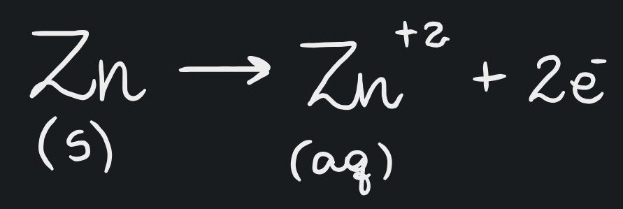
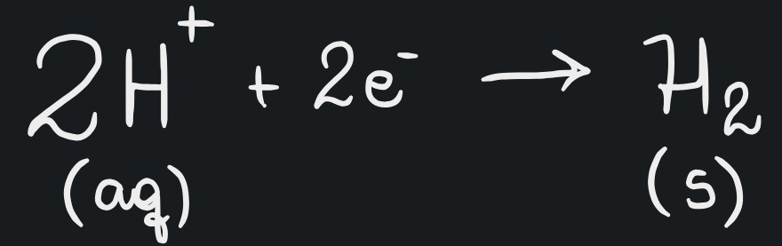
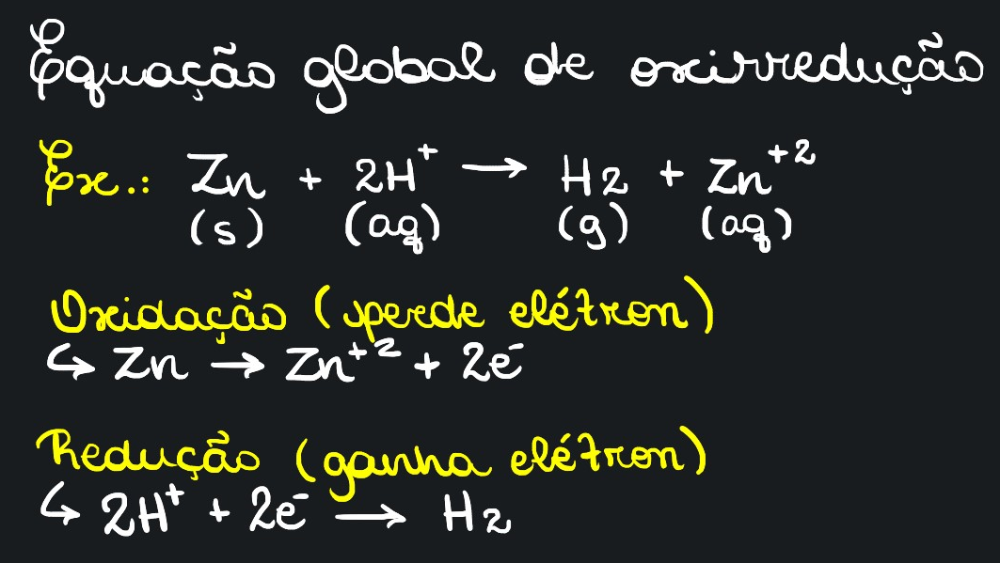

# Oxidação e Redução

* Ver também: [NOX](numero-de-oxidacao-nox.md)

## Oxidação

* Aumenta o [NOX](numero-de-oxidacao-nox.md)
* É a perda de elétrons (fica mais positivo)

<figure><figcaption></figcaption></figure>

## Redução

* Diminui o [NOX](numero-de-oxidacao-nox.md)
* É o ganho de elétrons (fica mais negativo)

<figure><figcaption></figcaption></figure>

## Oxirredução

* Um ou mais elementos sofrem variações no [NOX](numero-de-oxidacao-nox.md) ao reagir.
* Oxirredução, Oxidorredução ou Redox

## Agente Oxidante

* É quem causa a oxidação, logo, quem **sofre a redução**.
* Ex.: Na equação acima, o **agente oxidante** é o $$H^{+}$$, que foi quem reduziu em $$H_2$$

## Agente Redutor

* É quem causa a redução, logo, quem **sofre a oxidação**.
* Ex.: Na equação acima, o **agente redutor** é o Zn (zinco), que foi quem oxidou em $$Zn^{+2}$$

## Semirreações

* FAZER!

## Equação Global

* O que for tirado deve ser dado! Não adianta tirar 2 elétrons de um sem colocar em outro.

<figure><figcaption>
Equação global desmembrada
</figcaption></figure>

### Balanceamento

* FAZER
