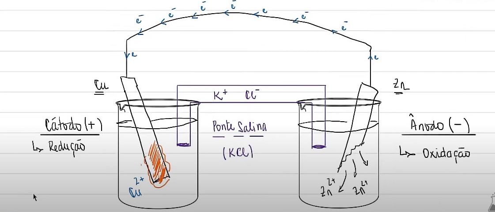
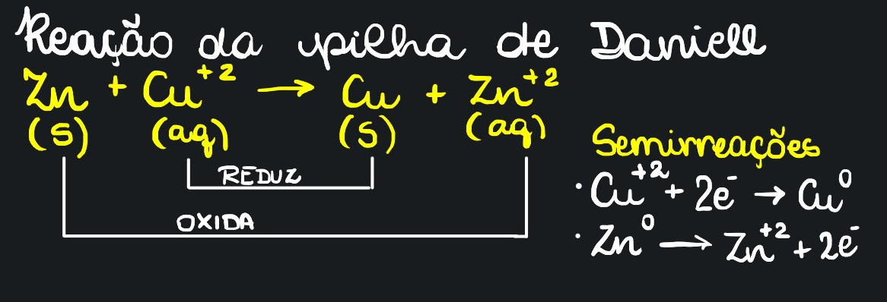

# Pilha de Daniell

## Descrição

* Criada em 1836 por John Daniell

### Montagem e Processo

* 2 pedaços de metal: 1 de cobre e 1 de zinco -> São **eletrodos** \
  \-> Os eletrodos são mergulhados em soluções aquosas de cátions deles próprios: O Cu emerso no $$Cu^{+2}$$ (Na solução de $$CuSO_4$$)e o Zn emerso no $$Zn^{+2}$$ (Na solução de $$ZnSO_4$$)
* Um fio metálico servirá de conexão entre os eletrodos
* Além dos eletrodos conectados, também será necessária uma ponte que conecte as soluções. \
  \-> Vai se a **ponte salina**, onde ainda é adicionada uma solução de KCl. (Eles geralmente são separadas por algodão, por exemplo, a fim de não misturar o sal com as soluções.
* No fio metálico, <mark style="color:red;">**teremos uma lâmpada acoplada, que irá acender, por conta de uma diferença de potencial elétrico entre os eletrodos**</mark> \
  \-> Potencial El. de Cobre > Potencial El. de Zinco -> Diferença de 1.1V\
  \-> A placa do Zinco sofrerá uma corrosão (desgaste)\
  \-> Logo, os elétrons buscam o maior potencial, indo, via fio metálico, do zinco para o cobre
* Assim, o eletrodo de cobre estará mais eletricamente negativo, atraindo os $$Cu^{+2}$$, que se reduzirão ao se acoplarem na placa, ou seja, adicionando mais cobre metálico na placa.
* Eletrodo de Zinco seria o polo negativo da pilha (ânodo), e o Cobre, o positivo (cátodo).

<figure><figcaption>
Esquemática da Pilha de Daniell -> Prof. Igor Química
</figcaption></figure>


CRAO -> Cátodo Reduz, Ânodo Oxida


### Reação

* Redução do Cobre -> Atrelada à deposição de mais Cobre no eletrodo
* Oxidação do Zinco -> Atrelada ao desgaste do Zinco&#x20;
* Representação Esquemática: $$Zn (s) | Zn^{+2} (aq) || Cu^{+2} (aq) | Cu (s)$$ \
  \-> Barra Única (|): mudança de fase \
  \-> Barra Dupla (||): ponte salina

<figure><figcaption>
Reação da pilha de Daniell
</figcaption></figure>

##
